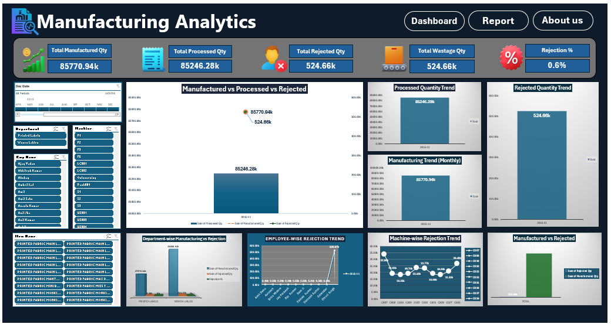
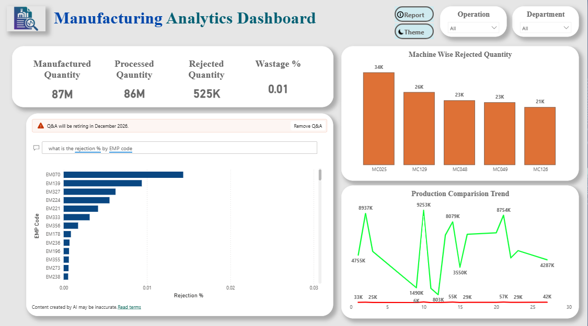

# manufacturing-analytics-dashboard
End-to-end data analysis project using SQL, Excel, and Power BI
# 📊 Manufacturing Analytics Dashboard

## 🚀 Project Overview

Designed and developed an end-to-end data analytics solution to analyze manufacturing operations, identify defect patterns, and improve production efficiency. The project leverages data-driven insights to support better decision-making at factory and management levels.

---

## 🎯 Problem Statement

Manufacturing units faced challenges in:

* High defect/rejection rates
* Limited visibility into production performance
* Difficulty in identifying underperforming factories and workforce

This project aims to solve these challenges through structured data analysis and visualization.

---

## 🛠️ Tools & Technologies

* **SQL** – Data extraction, transformation, and analysis
* **Microsoft Excel** – Data cleaning and preprocessing
* **Power BI** – Interactive dashboard and visualization
* Tablue = Interactive Dashboard

---

## 📂 Dataset Details

* **Size:** 10,000+ records
* **Data Includes:**

  * Production metrics
  * Defect and rejection data
  * Employee performance
  * Factory-level insights

---

## 📊 Dashboard Preview

 

---

## 📈 Key Analysis Performed

* Factory-wise defect and rejection analysis
* Employee performance evaluation
* Monthly production trend analysis
* Root cause identification for defects
* Comparative performance analysis across units

---

## 📉 Key Insights & Business Impact

* Identified **15–20% potential reduction in defects**
* Highlighted **top factories contributing ~60% of total defects**
* Detected performance gaps in workforce impacting quality
* Enabled faster and more informed decision-making through dashboards

---

## 🧠 Skills Demonstrated

* Data Cleaning & Transformation
* SQL Query Writing & Optimization
* Data Analysis & Interpretation
* Dashboard Development (Power BI)
* Business Insight Generation

---

## ▶️ How to Use

1. Open `PowerBI_Dashboard.pbix` in Power BI Desktop
2. Execute queries from `SQL_Analysis.sql` for data insights
3. Explore `Manufacturing_Data.xlsx` for raw and processed data

---

## 📌 Project Highlights

* End-to-end data analytics workflow
* Real-world manufacturing use case
* Focus on business impact and decision-making
* Clean and structured project documentation

---

## 💼 Conclusion

This project demonstrates the ability to transform raw manufacturing data into actionable insights and interactive dashboards, enabling organizations to improve operational efficiency and reduce defects.

---
